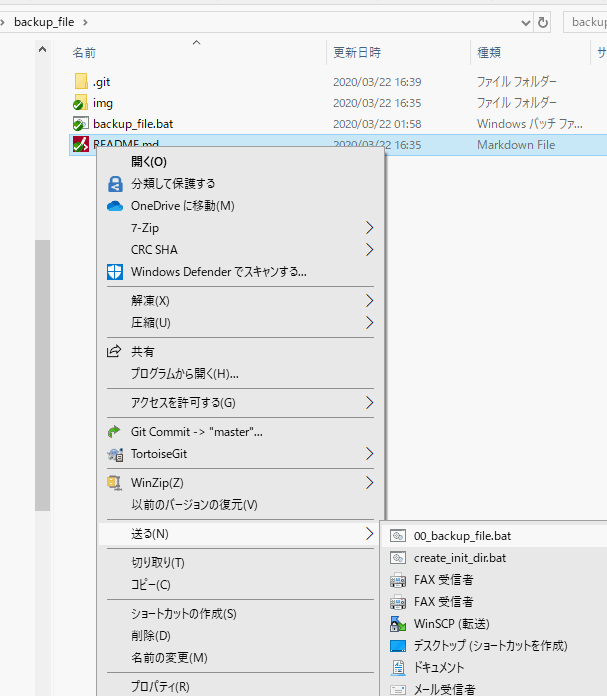
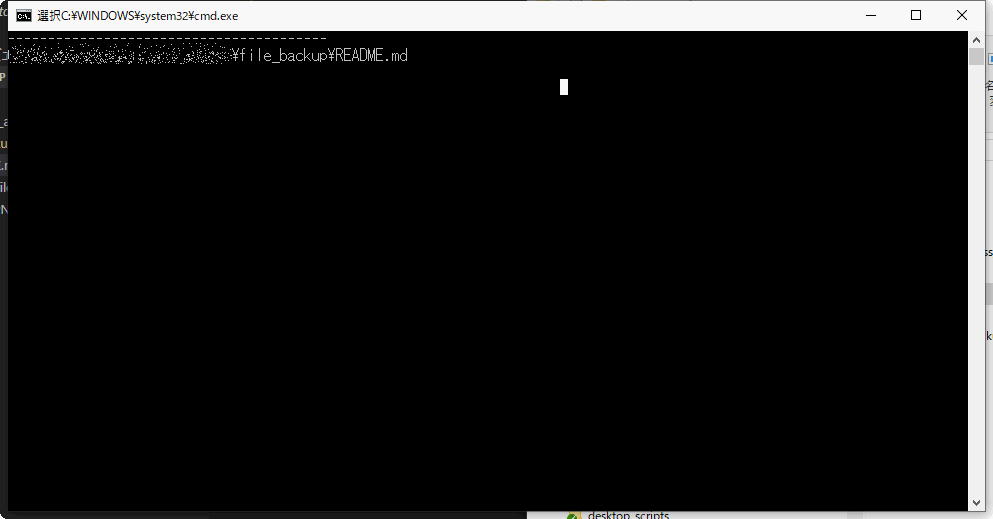

# このプログラムについて　What is backup_file
ドラッグ＆ドロップされたファイルをバックアップします。
バックアップは、ファイルと同じディレクトリのなかにあるoldフォルダーに退避します。
oldフォルダーがない場合は、自動的に生成します。

This program creates "old" folder and backup input file with backup datetime 
this is windows batch file.

# インストールと設定 Install and Setup

ソースコードをcloneします。フォルダーは、適当な場所においてください。
git clone and move directory where you like.

`git clone git@github.com:mskzshny/backup_file.git`

エクスプローラを起動し、アドレスバーに`shell:sendto`と入力して、sendtoフォルダーを開きます。
open windows explorer and input `shell:sendto` in addrress bar.

sendtoフォルダにbackup_file.batのショートカットを作成します。例では、`00_backup_file.bat`として作成しています。　create `backup_file.bat` short cut in sendto filder.

# 使い方 How to use

1. バックアップしたいファイルを右クリックして、送る＞`backup_file.bat`を選択すると、バックアップを開始します。
    
1. コマンドプロンプトが起動しバックアップが行われます。
       
2. バックアップされたファイルを確認します。
       
    
    バックアップを実行した秒までの日時が、ファイル名についています。

# 備考、注意事項 mics

 - `(`　`)` 半角のかっこのあるファイル名は、コピーできないようです。
 - フォルダーもコピーできますが、念の為コピー後フォルダーとコピー前フォルダーのファイル数が一致しているか確認してください。
 - `backup_fil.bat`ファイルをデスクトップにおいて、バックアップしたいファイルをドラッグ＆ドロップする方法もあります。